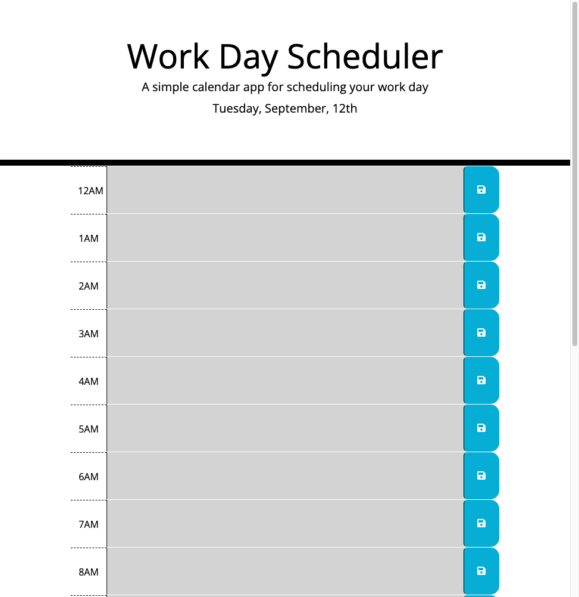

# Daily Planner App
## Description
Welcome to the Daily Planner App! This readme file provides you with essential information about the app, helping you get stated quickly and make the most of your daily planning experience.
## Screenshot

## Usage
1. Open app URL in browser
2. Add task by clicking text box next to time and fill in task details
3. Click the save icon to save
## Links
https://mam-rahman.github.io/Daily-Planner-App/
## License
MIT License